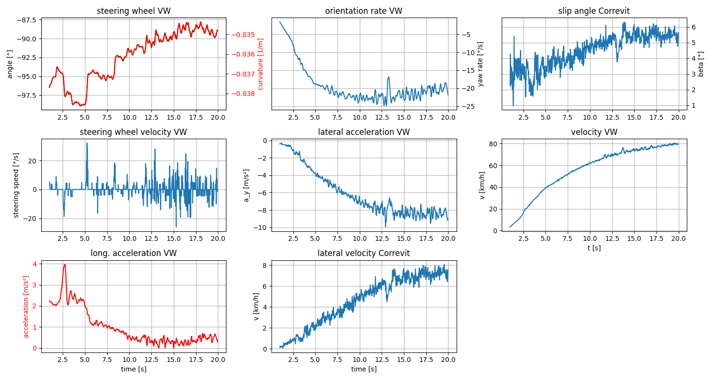

# Vehicle Dynamics Model and Parameterization

A well-suited vehicle dynamics model plays a pivotal role in the virtual development and verification of motion planning and control algorithms. There are several models available, including single-track, double-track, multi-body models, and finite element simulations, designed to capture the intricacies of vehicle dynamics [1]. However, the challenge lies in selecting the optimal model, striking a balance between complexity and efficiency.

We adopt a dynamic nonlinear single-track model to account for essential dynamic effects, considering the combined slip of lateral and longitudinal tire forces, rolling resistance, and aerodynamic effects. To accurately simulate lateral tire forces, we use the Pacejka Magic Formula [2].

## Model Validation and Parameter Identification

Validating the chosen model with real-world data and identifying parameter values are crucial for ensuring accuracy and reliability. We measure some parameters, including the position of the center of gravity and vehicle mass. We conduct steady-state circular driving behavior tests compliant with ISO 4138 [3] to identify further parameters. Our focus is on the constant steering-wheel angle approach, and we employ two variations: discrete- and continuous speed increase tests. We collect motion and steering data from the GPS-IMU, Correvit, and VW Series sensors.

To cover both low- and high-velocity ranges, we conduct tests at velocities from 5 km/h up to 130 km/h, with steering wheel angles ranging from 45 degrees to 540 degrees in both turning directions. Under normal circumstances, i.e., clear weather, negligible wind speed, and an outside temperature of 23 °C, we use Bridgestone 235/50R18 101H summer tires.

### Vehicle Setup:
- number of passengers: one driver (65 kg)
- number of mounted seats: 5 seats
- total vehicle mass: 2520 kg
- lf = 1.484 m: distance from spring mass center of gravity to front axle 
- lr = 1.644 m: distance from spring mass center of gravity to rear axle 
- outside temperature: 23 °C
- wind speed: almost 0 km/h
- tyre type, brand, size: 4 x Bridgestone 235/50R18 101H summer tyres
- tyre temperature: unknown

| Tire Position     | Air Pressure |
|-------------------|--------------|
| Front Right (FR)  | 3.4          |
| Rear Right (RR)   | 3.1          |
| Front Left (FL)   | 3.5          |
| Rear Left (RL)    | 3.4          |

### Steady-State Circular driving behavior ISO 4138
We are using method 2 mentioned in ISO 4138: the constant steering-wheel angle test method.
- constant steering wheel angle
    - left turns and
    - right turns
- varying speed: variation:
    - with discrete test speeds: the steering-wheel angle is applied with the vehicle traveling at discrete speeds, and is maintained until steady-state conditions are reached.
    - with continuous speed increase: the steering-wheel angle is held fixed while speed is increased continuously at a slow rate, up to the limit of control.
- calculating radius from vehicle motion

### Approaches used:
1. Discrete test speed:
    1. At each selected speed, the steering wheel shall be turned to the pre-selected steering-wheel angle and maintained until steady-state conditions, including speed and throttle, are attained.
    2. The steering-wheel angle and throttle position shall be held constant for at least 3 s.
    3. change turning direction and do the same again
    4. select next speed 

2. Continuous speed increase:
    1. The steering-wheel angle shall be held constant
    2. the vehicle speed is steadily increased
    3. change turning direction with same steering angle and drive the same velocity profile again 

### Variations:
- speed = [5, 10, 20, 30, 40, 50, 70, 80, 90, 110, 130] in km/h
- steering wheel angle = [45, 90, 180, 360, 540]
- turning direction = [left, right]

## Experiment example
This is a sample from the experiments done using the second approach (Continuous speed increase). 
The plots of data recorded originate from three main sources: VW series sensors, GPS + IMU and Correvit sensor. 

## Parameter Tables

The main identified single-track and tire model parameters are listed in the following tables:

### Single Track Parameters

| Parameter        | Value   | Unit              | Description                         |
| ---------------- | ------- | ----------------- | ----------------------------------- |
| $l$              | 3.128   | m             | Wheelbase                           |
| $l_{\mathrm{f}}$ | 1.484   | m             | Front axle to center of gravity     |
| $l_{\mathrm{r}}$ | 1.644   | m             | Rear axle to center of gravity      |
| $m$              | 2,520   | kg          | Vehicle mass                         |
| $I_{\mathrm{z}}$ | 13,600  | kg·m²       | Moment of inertia in yaw            |
| $\rho$           | 1.225   | kg/m³       | Air density                         |
| $A$              | 2.9     | m²            | Cross-sectional frontal area        |
| $c_{\mathrm{d}}$ | 0.35    |                   | Drag coefficient                    |

### Pacejka Tire Model Parameters

| Parameter | Front | Rear  | Description         |
| --------- | ----- | ----- | ------------------- |
| $B$       | 10    | 10  | Stiffness factor    |
| $C$       | 1.3     | 1.6   | Shape factor        |
| $D$       | 1.2·$F_{z,f}$ | 2.1·$F_{z,r}$ | Peak value |
| $E$       | 0.97    | 0.97    | Curvature factor    |

## References

- [1] Guiggiani, Massimo. "The science of vehicle dynamics." Pisa, Italy: Springer Netherlands 15 (2014).

- [2] Pacejka H and Besselink I (1997) Magic formula tyre model with transient properties. Vehicle system dynamics 27(S1): 234–249.

- [3] ISO (2021) Passenger cars: steady-state circular driving behavior:
open-loop test methods (iso 4138: 2021, idt).
