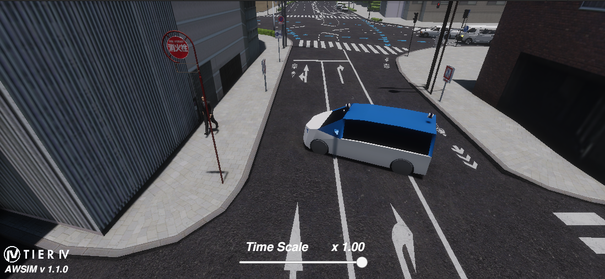

# EDGAR Prefab for AWSIM
In this guide, it is explained how the tools stored in the repository can be used to digitally replicate EDGAR in AWSIM.

## URDF to Unity Coordinates
AWSIM is implemented as a UNITY plugin. Due to unity using a different coordinate system than ros, the script `urdf2unity_transform.py` allows for an easy transformation from the ros coordinate system to the unity coordinate system.
To transform the existing URDF-file for EDGAR, simply execute the following commands in your command line after switching to this folder:
``` 
python3 unity_transform.py
```
you will then find the corresponding `unity_transform.urdf` file in this folder. To use the current sensor setup however, it is sufficient to use the prefab for AWSIM introduced next.

## AWSIM Prefab
The current sensor configuration and the EDGAR geometry has been included by us in a UNITY prefab to allow a fast integration of EDGAR into AWSIM.
Based on the available sensor suite in AWSIM, only LiDAR, camera, GNSS and IMU are part of the prefab. Sensor and topic naming orients itself on the URDF file and common conventions.
In the following, a list of the available topics can be found:
### Vehicle Status Sensor:
``` 
/vehicle/status/control_mode
/vehicle/status/gear_status
/vehicle/status/steering_status
/vehicle/status/turn_indicators_status
/vehicle/status/hazard_lights_status
/vehicle/status/velocity_status
``` 
### GNSS Sensors:
```
/sensing/gnss_left/pose
/sensing/gnss_left/pose_with_covariance
/sensing/gnss_right/pose
/sensing/gnss_right/pose_with_covariance
```

### Cameras (exemplary for the camera_sr_front_left):
```
/sensing/camera/camera_sr_front_left/image_raw
/sensing/camera/camera_sr_front_left/camera_info
```

### Lidar Sensors:
```
/lidar_ouster_left/pointcloud_raw
/lidar_ouster_left/pointcloud_raw_ex
/lidar_ouster_left/instance_id

/lidar_ouster_right/pointcloud_raw
/lidar_ouster_right/pointcloud_raw_ex
/lidar_ouster_right/instance_id

/lidar_innovusion_front/top/pointcloud
/lidar_innovusion_front/top/pointcloud_ex
/lidar_innovusion_front/instance_id

/lidar_innovusion_back/top/pointcloud
/lidar_innovusion_back/top/pointcloud_ex
/lidar_innovusion_back/instance_id
```
## Adding EDGAR to AWSIM
Adding the prefab to AWSIM can happen via two ways:
- Importing the prefab via `Assets->Import new Assets` and select the EDGAR prefab from `models->high res->AWSIM`
- drag the prefab from the explorer to the asset library in unity.
Further, EDGAR then needs to be spawned in the scene by dragging the prefab from the asset library in Unity into the environment object. When hitting play, EDGAR should now send the corresponding sensor messages and react to inputs.

The prefab was generated using the [AWSIM Documentation](https://github.com/tier4/AWSIM/blob/main/docs/Components/Vehicle/AddNewVehicle/AddAVehicle/index.md)




## Changing Sensor Setup
Sensor setup, including the sensor position and orientation, can be changed only in the unity environment by selecting the respective link object in the `URDF` parent. Please refrain from transforming the sensor directly, but rather change the parent link to achieve the repositioning. For more details, refrain to the corresponding [AWSIM documentation page](https://github.com/tier4/AWSIM/blob/main/docs/Components/Vehicle/AddNewVehicle/AddSensors/index.md).


