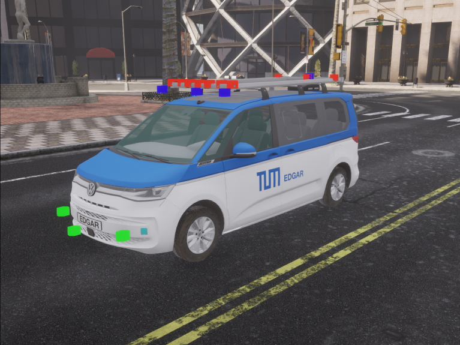

# 3D Digital Twin for CARLA Open Source Simulator

## About

In this folder you will find the necessary documentation and files for importing EDGAR into the [CARLA](https://carla.org/) Open Source Simulator. 

### Files and Descriptions

The files available in this directory are the output of the step [Bind and model the vehicle](https://carla.readthedocs.io/en/latest/tuto_A_add_vehicle/#bind-and-model-the-vehicle) in the official documentation.
A short description of the files is given in the table below:
| File Name             | Description                                                   |
|-----------------------|------------------------------------------------------         |
| EDGAR_T7_Carla.tar.gz | The compressed Unreal Assets to paste in the CARLA build from source |
| sensors_to_carla.py | Imports all the sensors specified in the urdf file into the CARLA environment. |

## Getting Started

Unfortunately, CARLA prevents a plug-and-play integration of customized assets in its packaged version. Therefore, you need to download the build version of CARLA and the Unreal Engine Editor to get started. Follow the instructions of the official documentation for [Windows](https://https://carla.readthedocs.io/en/latest/build_windows/) or [Linux](https://carla.readthedocs.io/en/latest/build_linux/) until you are ready to launch CARLA via the Unreal Engine Editor using
```
make launch
```

This will bring up the Unreal Editor. From here you have **two options** available.

## Usage Option 1
Fast option: works in CARLA 0.9.14 with Unreal 4.26 and Ubuntu 22.04. However, the option of copying precompiled assets into the unreal engine is prone to errors if versions, file paths, etc. change. If you have no success, try option 2.

1. Unzip the content of [EDGAR_T7_Carla.tar.gz](EDGAR_T7_Carla.tar.gz) into the CARLA content folder `tar -xf EDGAR_T7_Carla.tar.gz -C CARLA_ROOT/Unreal/Carla4UE/Content/Carla` 
2. Warning: this will override your *VehicleFactory.uasset* file with [ours](Unreal/CarlaUE4/Content/Carla/Blueprints/Vehicles/VehicleFactory.uasset). If you have already created custom vehicles, you need to manually add the EDGAR vehicle to your vehicle garage as described in the secection [below](#adding-the-vehicle-to-the-vehicle-factory)
3. Continue to running the [simulation](#run-the-simulation)

## Usage Option 2
This option involves manually creating the `*.uasset` files starting from the provided ``.fbx`` files 
- [Skeletal / Render Mesh](../../source/3d_model/high_res/Edgar_T7.fbx)
- [Physcial Assest Mesh](../../source/3d_model/high_res/SMC_T7.fbx) 
- [Collision Mesh](../../source/3d_model/high_res/SMC_sc_T7.fbx)

It is necessary to import the vehicle, mesh, physical asset mesh and raycasting mesh into Unreal Engine Editor and create the necessary blueprints according to the official documentation [Import and configure the vehicle](https://carla.readthedocs.io/en/latest/tuto_A_add_vehicle/#import-and-configure-the-vehicle). 
The steps are briefly described below

1. Create a folder `EDGAR_T7` for the vehicle under the Unreal Engine Folder `Content/Carla/Static/Car/4Wheeled`
   - *Depending on the CARLA distribution the folder can also be called* `Content/Carla/Static/Vehicles/4Wheeled`
2. Import the skeletal / render mesh [EDGAR_T7.fbx](../../source/3d_model/high_res/Edgar_T7.fbx), the physical asset mesh [SMC_T7.fbx](../../source/3d_model/high_res/SMC_T7.fbx) and raycasting mesh  [SMC_sc_T7.fbx](../../source/3d_model/high_res/SMC_sc_T7.fbx).
3. Setting the physical asset mesh. Here the SMC_T7.fbx file is needed.
4. Create the Animation Blueprint.
5. Configure the Animation Blueprint.
6. Prepare the vehicle and wheel blueprints.
7. Configure the wheel blueprints.
8. Configure vehicle blueprint. Here the SMC_sc_T7.fbx mesh is needed.
9.  Add the vehicle to the Blueprint Library.
    - In this step you must add the created blueprint to the array of vehicles. Choose the `make` and `model` parameters. We use `edgar` as make and `t7` as model.

## Adding the vehicle to the vehicle factory
To add the vehicle blueprint (either using option 1 or option 2) to the vehicle factory, you need to open the vehicle factory located unter `<Carla_Root>/Unreal/CarlaUE4/Content/Carla/Blueprints/Vehicles/VehicleFactory.uasset`. As shown in the image below, follow these steps
1. In the Generator Definition Tab of the Window, click on the *Vehicles* component
2. In the detail section to the left, unter *Default Values* add a new index to the array of vehicles.
3. Enter a *make* and *model* for the vehicle. We use `edgar` as make and `t7` as model
4. Select the vehicle blueprint to use for this vehicle. In our case it is `BP_EDGAR_T7` (located under `<Carla_Root>/Unreal/CarlaUE4/Content/Carla/Blueprints/Vehicles/EDGAR_T7/BP_EDGAR_T7.uasset`)
5. Click *Compile* and *Save*


## Run the simulation
Start the carla server from within unreal editor:
1. Execute `make launch` from your CARLA root directory to launch the editor
2. Hit *play* in the editor to launch the CARLA server


From a terminal in `PythonAPI/examples` run 
```sh
python3 manual_control.py --filter 'vehicle.<make>.<model>' # make and model in lowercase letters
```
E.g. to test the EDGAR in CARLA you can enter
```sh
python3 manual_control.py --filter 'vehicle.edgar.t7'
``` 

We have also provided a script to load the vehicle into the simulator and add the sensors according to the parameters file to it. You can execute this script with
```sh
python3 sensors_to_carla.py
```
This will automatically choose the sensor paramteres of edgar defined in our urdf file and uses the *edgar.t7* as make and model. If you wish to use your own sensor setup definition or vehicle naming, you can call the script with the following two arguments:
```sh
python3 sensors_to_carla.py --urdf <your_urdf_file> --vehicle <your_make>.<your_model>
```

## Expected Output
The following pictures show the result after importing the vehicle and running the `sensor_to_carla.py` script which draws bounding boxes for each sensor actor (camera in red, lidar in blue, radar in green)




