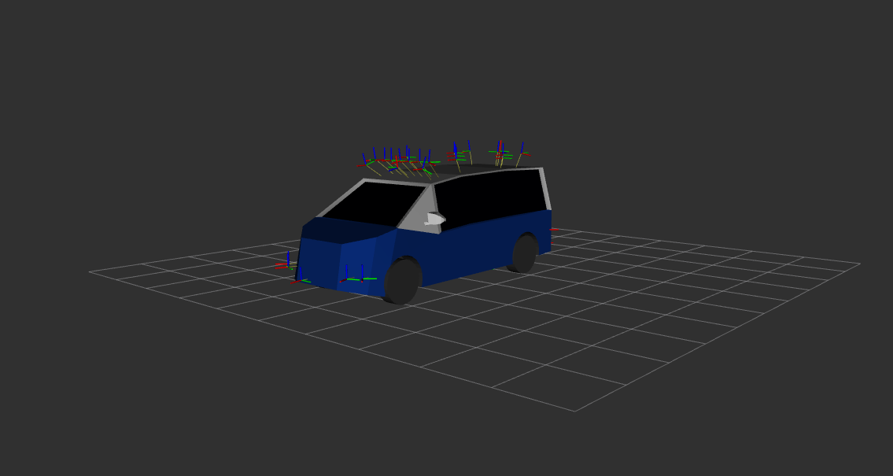

## EDGAR State Publisher

In order to integrate the edgar sensor description into a state publisher, the [edgar.urdf](../../source/sensor_parameter/edgar.urdf) file has to be referenced accordingly. 
We will provide an example using the official ROS [robot_state_publisher](https://github.com/ros/robot_state_publisher.git) package. 

First, clone the robot_state_publisher package into your ROS workspace src folder
```sh
git clone https://github.com/ros/robot_state_publisher.git
```
and install the package.

```sh
colcon build --packages-select robot_state_publisher
source install/setup.bash
```

Once the robot_state_publisher is ready to go move the [edgar.urdf](../../source/sensor_parameter/edgar.urdf) into the URDF folder of the newly installed package. 

```sh
mv path/to/edgar.urdf path/to/robot_state_publisher/urdf
```

In case you want to use the EDGAR [3d model](../../source/3d_model/low_res/edgar.dae) make sure you provide a correct absolute path to the model. You will find the reference in the first link definition of the [edgar.urdf](../../source/sensor_parameter/edgar.urdf) as shown in this urdf snippet:

```
  <!--Base frame-->
  <link name="rear_axle_center_ground">
    <visual>
      <origin xyz="0 0 0"/>
      <geometry>
	      <mesh filename="file:///absolute/path/to/the/3d_model/low_res/edgar.dae" scale="1 1 1"/>
      </geometry>
    </visual>
  </link>
```

In the next step, edit the launch file of the robot_state_publisher with the proper urdf reference:

```ruby
def generate_launch_description():
    pkg_share = FindPackageShare('robot_state_publisher').find('robot_state_publisher')
    urdf_dir = os.path.join(pkg_share, 'urdf')
    urdf_file = os.path.join(urdf_dir, 'edgar.urdf')
    with open(urdf_file, 'r') as infp:
        robot_desc = infp.read()
```

We also provide [edgar.launch.py](launch/edgar.launch.py), feel free to use it.

Once the URDF file and the [3d model](../../source/3d_model/low_res/edgar.dae) is referenced properly, you can test the integration by launching 

```sh
ros2 launch robot_state_publisher edgar.launch.py
```

Vizualize the robot model in rviz. You can use our [edgar.rviz](rviz/edgar.rviz) configuration file.

```sh
rviz2 -d path/to/edgar.rviz
```





For further details regarding the robot state publisher please refer to the official ROS Robot State Publisher:
https://github.com/ros/robot_state_publisher/tree/humble